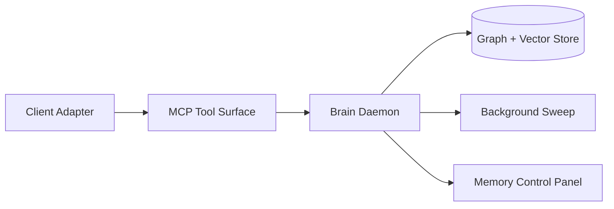
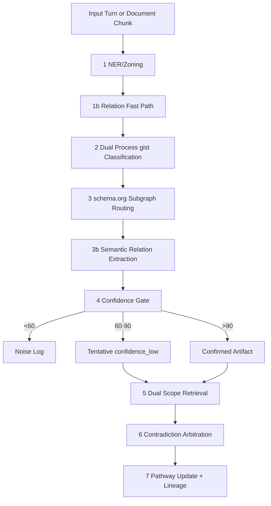
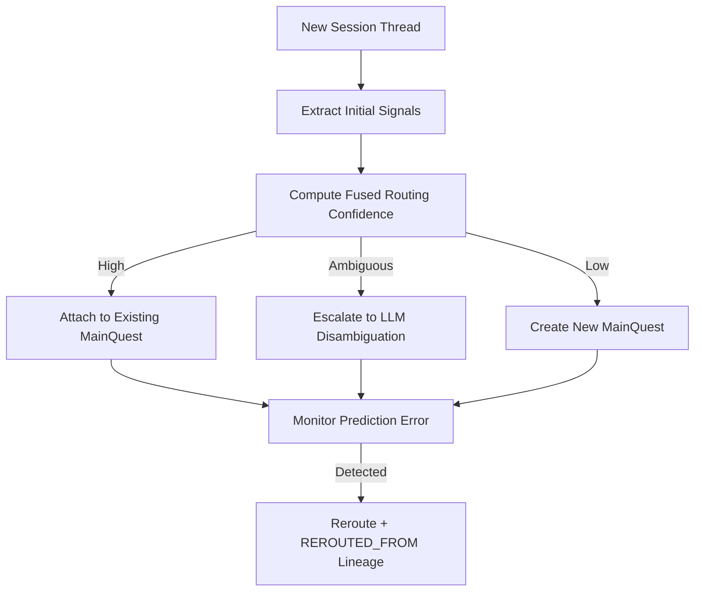

# **Side Quests \- Inventor's Notebook**

This document serves as the official record for the conception and development of the invention known as "Side Quests." All entries are to be considered confidential and proprietary.

### **Journal of Updates**

* **March 28, 2026 (Night):** **B12 — Out-of-Band Behavioral Integrity Monitoring formally documented.** Named and added as a distinct IP claim, separate from the general Cocktail Party Effect (which governs memory formation). Named principle: **Out-of-Band Behavioral Integrity Monitoring**. Distinguished from the Cocktail Party Effect as follows: Cocktail Party governs *what to remember* (selective memory admission); Out-of-Band Behavioral Integrity Monitoring governs *whether an agent's behavior has been compromised* (constraint violation detection). Same daemon, same passive architecture, distinct security application domain. Changes made: (1) Added new Section 5.5.D with full named principle, scope, and implementation detail. (2) Added "Anomaly / Security Sense" to the Cocktail Party cognitive senses table in 5.3. (3) Expanded Claim #7 in Section 5.7 to explicitly separate this claim from the Cocktail Party Effect. (4) Journal entry logged. No code change required — Step 4 Contradiction sense + GlobalConstraint nodes already implement this mechanically. Flagged to patent attorney as distinct claim.

* **March 25, 2026 (Evening):** **PROVISIONAL PATENT APPLICATION FILED.** Application # **64/017,066**, Confirmation # **7549**, Patent Center # **75018063**. Received **03/25/2026 7:34:17 PM ET**. Filed as micro entity ($65 fee). Documents submitted: (1) PPA-Specification-Draft.docx (specification, 10 pages), (2) PPA-Figures-Labeled-Combined.pdf (drawings, 7 pages, FIG. 1–7), (3) sb0015a-filled-flat.pdf (Certification of Micro Entity Status, PTO/SB/15A), (4) auto-generated Application Data Sheet (5 pages). Patent Center auto-generated the provisional cover sheet from online form data — SB/16 PDF upload was not required. Entity status: Micro. Priority date established: March 25, 2026. **Non-provisional must be filed by March 25, 2027 to claim priority.**
* **March 25, 2026:** Completed comprehensive audit of the PPA Specification Draft against all implementation blueprints (B17, B18, B14) and the current codebase. Discovered and corrected 15 discrepancies, applying 9 major edits to PPA-Specification-Draft.html. Key corrections: (1) Fixed outdated Working Memory claim — spec previously stated "short-term working memory remains with the external assistant client," now correctly describes the **Shadow Representation** model where the graph tracks LOADED edges, token burden estimation, demotion factor (0.3×), and Session Handoff Intelligence. (2) Rewrote the Gated Consolidation Loop section to reflect the actual 9-step sequence (1, 1b, 2, 3, 3b, 4, 5, 6, 7) with the **Shape-First Principle** explicitly named as a patent claim — ontological classification precedes semantic work at every pipeline level. (3) Expanded Quest Routing to cover the **Hippocampus Router** dual-process mechanism (fast vector path vs. deliberate multi-signal fusion), progressive consolidation states (tentative → consolidated → locked), and **Long-Term Depression** for prediction-error-driven reconsolidation. (4) Expanded Graph Structure to include Lesson nodes (synthesized at quest completion for cross-quest reasoning), ontology class nodes with centroid embeddings, and three-tier CO_OCCURS_WITH promotion mechanics. (5) Added entirely new spec sections for **Cross-Quest Analogical Reasoning** and **Proactive Insight Surfacing** (B14) — both previously absent from the filing document despite being implemented IP claims. (6) Strengthened two-tier ontology references to explicitly name **gist (Semantic Arts)** and **schema.org** as exemplary embodiments in Steps 2 and 3, rather than genericizing them. (7) Expanded Summary of Invention and Definitions/Terminology with all new biomimetic IP claims. Regenerated DOCX from updated HTML (13,135 bytes, estimated ~12–14 pages). Verified all 7 figure PDFs remain accurate — no drawing changes needed. Assessed SB/16 page count field (shows "11" vs actual ~12–14) as immaterial for provisional filing. Established this notebook as the canonical inventor's notebook, superseding the earlier version.  
* **March 24, 2026 (Final PM):** Resolved the USPTO drawings requirement identified in peer vetting. Added a formal "Brief Description of the Drawings" subsection (Section 6.1) with patent-spec-style FIG. 1–FIG. 7 descriptions. Added a standalone patent figure packet (SideQuests-Patent-Figures.md) with one figure per section ready for PDF export. Expanded Fig. 1 to show the dual passive/active capture paths. Expanded Fig. 3 to show all six Cocktail Party senses (Decision, Constraint, Plan, Entity, Contradiction, Anomaly). Expanded Fig. 5 to include Session Handoff Intelligence. Added Long-Term Depression (LTD) to Fig. 6 reconsolidation path. Added Fig. 7 for Synaptic Pruning, Hebbian CO_OCCURS_WITH accumulation, and Long-Term Potentiation promotion. Fixed broken Mermaid syntax in Fig. 4. Standardized all captions to patent-spec "FIG. X illustrates..." language.  
* **March 24, 2026 (Late PM):** Hardened the disclosure for provisional filing readiness by adding explicit claim-to-implementation mapping, alternative embodiments/equivalents, and best-mode implementation details. Added concrete reduction-to-practice evidence for installer hardening and multi-client registration, including Codex Desktop auto-detection/registration paths and validated install regression tests. Documented security invariants (stdio transport, local bind policy, canonical path enforcement) as non-optional system constraints to strengthen enablement and defensibility.  
* **March 24, 2026 (PM):** Integrated formal academic benchmarking and autonomous research methodologies into the testing framework. Recognized that "recursive self-improvement" loops (e.g., Andrej Karpathy's auto-research) suffer from "Hypothesis Regression" due to context bloat. Formalized the testing methodology to include SWE-CI, LoCoBench, and AMA-Bench to mathematically prove that the Side Quests Graph-RAG architecture outperforms standard vector RAG in multi-session, interdependent tasks. Logged recent academic papers (*MemoryArena*, *AMA-Bench*) as Prior Art to establish the non-obviousness of the graph-based solution.  
* **March 24, 2026:** Expanded the "Open-Source Engine Swap" and Phase 0 testing strategy to explicitly include **VS Code Copilot (Autonomous Mode Preview)**. Recognized that as major enterprise tools introduce autonomous agentic execution, they inherit the same "Memory Wall" flaws as OpenClaw. Formalized the cross-agent testing criteria: successfully demonstrating that OpenClaw and an autonomous VS Code Copilot instance can share and update the exact same Kùzu knowledge graph simultaneously via the MCP server. This empirically proves the "Universal Brain / Decoupled System" architectural claim.  
* **March 20, 2026 (Night):** Finalized the mechanical implementation of "Working Memory Awareness" via the B18 blueprint. Refined the deduplication logic: instead of hard-filtering previously loaded nodes, the system applies a 0.3x relevance penalty ("Smart Deduplication"), allowing highly critical facts to be re-injected as refreshers if the context window gets too long. Conceived **Session Handoff Intelligence**, allowing the Brain Daemon to proactively transfer the top 5 \[LOADED\] thoughts from a previous session into a new session on the same quest, creating the illusion of continuous consciousness across devices and apps. Added the context\_status MCP tool for bloat detection.  
* **March 20, 2026 (Late PM):** Conceived and formalized **"Working Memory Awareness" (Context Window State Tracking)**. Realized that standard RAG injects redundant facts, bloating the context window. Solved this by using the Graph to track what the LLM currently knows. Every time a fact is injected into the prompt, a \[LOADED\] edge is drawn from the active Session to the ArtifactNode. The current\_truth tool now filters out already-loaded nodes, ensuring hyper-efficient token usage and preventing context bloat.  
* **March 20, 2026 (PM):** Finalized the technical architecture for the "Hippocampus Mechanism" (B17 Blueprint). Established the **Multi-Signal Routing Fusion** model, which weights contextual signals (workspace path, entity overlap via 1-hop traversal, semantic intent, and legacy git context) to route UI threads to MainQuests. Documented critical database constraints for kuzu==0.11.3, specifically circumventing in-place HNSW update limitations by keeping purpose\_embeddings unindexed for fast Python-side cosine similarity, and storing routing metadata on Session nodes to avoid relation table schema locks.  
* **March 20, 2026:** Massive architectural pivot toward true biomimicry. Deprecated the rigid "Git Branch / Folder" anchoring system in favor of **Semantic Quest Routing (The Hippocampus Mechanism)**. The Brain Daemon now uses initial conversational context (the first 1-2 messages) to perform an associative vector search, dynamically routing new chat threads to existing MainQuests or birthing new ones. Introduced "Prediction Error" detection to allow for dynamic memory reconsolidation (re-routing threads) if the AI misinterprets the context. This fully eliminates developer-tool dependencies, making the system frictionless for everyday consumers.  
* **March 19, 2026:** Refined Phase 3 consumer UX principles to prevent Phase 0 scope creep. Established four core tenets for the eventual everyday consumer release: Zero-config install, Invisible enrichment by default, Proactive surfacing (subtle visual feedback loops), and Visual lenses on demand. Clarified that "Seamless Handoffs" will occur via native desktop/browser extensions, avoiding fragile localhost chat links. Deferred action-oriented routing (e.g., exporting files) to post-Phase 3 to maintain strict focus on the core knowledge graph engine.  
* **March 18, 2026:** Formalized the "Division of Labor" between Short-Term Working Memory (Client RAM) and Long-Term Structural Memory (Brain Daemon). Established the baseline concept of tying short-term UI chat threads directly to long-term quests to solve context-window bloat via Just-In-Time Graph-RAG.  
* **March 13, 2026:** Finalized exact technical implementation specifications derived from engineering blueprints (CLAUDE.md). Locked in the database dependency to kuzu==0.11.3 (with a strategic migration path to the RyuGraph fork). Specified embedding architecture as FLOAT\[384\] using the sentence-transformers/all-MiniLM-L6-v2 model for optimal local HNSW indexing. Defined the explicit hooks for passive interception (e.g., UserPromptSubmit and notify\_turn for Claude Code).  
* **March 11, 2026 (Late PM):** Corrected a critical market positioning assumption. Explicitly documented that while the Phase 0 prototype utilizes developer-centric CLI tools, the ultimate target market is the "Everyday Consumer" (e.g., family planning, wellness coaching, casual AI users). Formalized the "Tesla Strategy": using the high-friction Phase 0 dev tool to prove the proprietary IP, which will eventually be wrapped in an invisible, zero-friction Browser Extension/Desktop App for normal users. Re-aligned the market fit with the ultimate goal of enterprise acquisition/licensing (The "Option C" Exit).  
* **March 11, 2026 (PM):** Refined the out-of-band security model based on architectural review. Clarified that the Brain Daemon must remain a strictly passive observer; it never actively spawns child LLMs, which preserves its zero-attack-surface posture. Scoped the security claim specifically as a **Conversation-Layer Anomaly Detector**, differentiating it from OS-level IDSs. Added the explore\_graph tool for directed 1-hop/2-hop graph traversal. Introduced the Lesson artifact node, synthesized upon MainQuest completion, to supercharge cross-project analogical reasoning.  
* **March 11, 2026:** Formalized a major new security use case and IP claim: **Memory-Based Intrusion Detection**. Realized that because the Brain Daemon utilizes the "Cocktail Party Effect" to passively intercept messages out-of-band, it serves as an independent security monitor. It can detect malicious prompt injections and jailbreaks that a compromised agent cannot. Furthermore, the Knowledge Graph tracks erratic behavior, flagging when an agent's actions suddenly deviate from historically high-strength GlobalConstraints.  
* **March 9, 2026 (Final Night):** Integrated the final round of architectural validations. Expanded the Gated Consolidation Loop to a precise 9-step sequence by introducing **Step 3b (Relation Extraction: Semantic Path)**, formally applying the "know the shape before doing semantic work" principle to relation extraction. Added **Error/Degraded Mode** handling (Scenario A/B) ensuring zero data loss during daemon or LLM outages. Formalized **Purpose/Intent Capture** (auto-synthesizing quest goals from early artifacts). Bootstrapped Step 2's System 1 with 105 seeded centroid examples.  
* **March 9, 2026 (Late PM):** Critical architectural pivot in Step 1b (Relation Extraction). Research confirmed that REBEL (the HuggingFace relation extraction model) is heavily biased toward encyclopedic, Wikipedia-style facts and performs poorly on out-of-domain text (e.g., software architecture or therapy notes). REBEL was removed entirely. Replaced it with a domain-agnostic, two-layer approach: Layer 1 uses fast spaCy dependency parsing to catch a small set of universal verbs (REQUIRES, ENABLES, CONTRADICTS), and Layer 2 uses the local LLM to reason out complex or domain-specific relationships. This officially elevates Side Quests to a true "Domain-Agnostic Cognitive Assistant."  
* **March 9, 2026 (PM):** Formalized a major architectural paradigm shift: **The Cocktail Party Effect (Selective Attention)**. Identified the critical flaw of relying on an LLM to decide what to remember. Shifted the ingestion architecture from LLM-dependent tool calls to a passive, "Always-On" interception model. The Brain Daemon now acts as a background listener filtering noise via the Step 4 (\<60%) gate and triggering specific cognitive "senses" (Decision, Constraint, Plan, Entity, Contradiction). Updated adapter instruction model to reflect this passive capture, reducing token overhead to a \~28 token system prompt.  
* **March 9, 2026:** Expanded the Biomimetic Heuristic Engine to explicitly include full Hebbian Learning ("Fire together, wire together") and Long-Term Potentiation (LTP) via a "Dual Edge" architecture. Integrated a SKOS-inspired Labeling System as first-class graph nodes to handle multi-phrasing semantic retrieval and dual-layer search logic.  
* **March 8, 2026:** Massive capability upgrade based on Claude architectural sessions. 1\) Expanded the Consolidation Loop to 8 steps by adding **Step 1b: Relation Extraction** (a gated spaCy \+ LLM pipeline to build semantic edges instantly). 2\) Replaced static confidence gates with a "Living Confidence" model (confidence\_low=true) that continuously re-scores tentative knowledge. 3\) Formalized **Synaptic Pruning** (based on the Ebbinghaus Forgetting Curve) with exact exponential decay and background sweep archive mechanics. 4\) Expanded Graph Schema to include Infrastructure Nodes (Session, LLMProvider, Workspace) for multi-machine analytics, and migrated the Ontology Routing Table into the graph itself (GistClass \-\> SchemaOrgType). 5\) Defined the JSON-RPC 2.0 IPC protocol and MCP tool JSON schemas.  
* **March 7, 2026 (Major Architectural Refinement):** 1\) Corrected the Gated Consolidation Loop to a precise 7-step biomimetic sequence: NER Zoning → gist Rapid Classification → schema.org Sub-graph Routing → Heuristic Pattern Matching → Dual-Scope Retrieval → Contradiction Arbitration → Pathway Update.  
  2\) Repositioned Dynamic Hybrid Ontology Routing (Steps 2–3) to PRECEDE pattern matching, enabling faster and more accurate confidence scoring — knowing the ontological shape of a concept before pattern matching dramatically narrows the template search space.  
  3\) Explicitly integrated Kahneman's 'Thinking Fast and Slow' dual-process theory as a named biomimetic principle: Step 2 gist classification implements a System 1 (embedding similarity, sub-millisecond) / System 2 (LLM fallback for ambiguous cases) hybrid classifier. This is now a named novelty claim.  
  4\) Specified a configurable LLM provider abstraction (Ollama default, GPT/Claude/Gemini as opt-in cloud providers). Uses an OpenAI-SDK-compatible interface so Ollama and cloud providers share the same code path.  
  5\) Updated Phase 0 architecture: removed OpenClaw fork. Phase 0 is now a standalone Brain Daemon \+ direct MCP STDIO adapters for Claude Code and Codex. OpenClaw fork is deferred to a later phase.  
* **March 7, 2026 (Late Night):** Added the exact cognitive analogy (coarse → fine → recognize) and technical payoff (template set collapsing) to Section 5.4.C. This explicitly documents how the ontology pre-filter mirrors human attention gating.  
* **March 6, 2026:** Integrated "Analogical Reasoning" (Cross-Quest Experience Transfer) into the Biomimetic Heuristic Engine. Documented the system's ability to infer learnings from historically distinct projects (e.g., pulling AWS deployment constraints from a project 3 months ago into a brand new MainQuest).  
* **March 5, 2026 (Late PM):** Refined the "Human-Agent Bridge" and "Open Brain" capabilities to ensure scalable graph normalization. Added a first-class Document instance node.  
* **March 5, 2026 (PM):** Explicitly documented two critical capabilities to ensure the system functions as a true "Universal Brain." 1\) **The Human-Agent Bridge.** 2\) **Universal Document Ingestion ("Open Brain" Capability).**  
* **March 5, 2026 (Mid-Morning):** Created a dedicated technical schematic (Section 5.4.C) for the **Dynamic Hybrid Ontology Routing**.  
* **March 4, 2026 (Final PM):** Hardened the novelty claims by transitioning the technical spine to a concrete **"Gated Consolidation Loop."** Added exact mechanical details for reversible merges. Radically tightened the Phase 0 security manifest.  
* **March 4, 2026 (Late PM):** Explicitly defined the "Engine Contract" and the algorithmic "Consolidation Loop". Tightened the product wedge to focus on a tangible "Decision Log & Constraint Ledger".  
* **March 4, 2026 (PM):** Strategic Pivot based on market/security analysis. Acknowledged Zep, Mem0, and Letta as competitors. Re-centered our absolute core IP differentiator on the **Biomimetic Heuristic Engine**. Added Temporal Truth Handling and Reversible Merges.  
* **March 4, 2026 (AM):** Added Section 5.4 (Technical Schematics & Data Structures) to provide an "enabling disclosure" of the invention.  
* **March 3, 2026:** Integrated the Model Context Protocol (MCP) as the universal wrapper for the Memory Core.  
* **February 28, 2026:** Upgraded the Ingestion Pipeline design to utilize a "Biomimetic Memory Extraction Flow."  
* **February 26, 2026:** Refined Phase 0 strategy. Defined local build strategy using Kùzu.  
* **September 19, 2025 (AM):** Identified the VectorSpaceLab/general-agentic-memory (GAM) open-source framework as a primary technical accelerator. Updated Section 8 ("Reduction to Practice Plan") to reflect the strategy of utilizing GAM's "Memorizer/Researcher" architecture to power the MCP Server, significantly reducing development risk and time-to-market.  
* **September 18, 2025 (AM):** Formalized the core system architecture. The invention will be built as a decoupled system comprising a user-facing "Side Quests Application" and a backend "Memory Core Platform (MCP) Server," based on the model proposed by industry experts like Tomaz Bratanic. This MCP will house the knowledge graph, vector store, and AI agents, serving as the project's "brain."  
* **September 17, 2025 (1:45 PM):** Corrected the dates in Section 2 ("Date of Conception") to reflect the actual start date of the project discussions on or before August 17, 2025\.  
* **September 17, 2025 (1:38 PM):** Updated Section 7 ("Prior Art") to include and analyze the feature-level conversation branching introduced by OpenAI. This addition helps to clearly differentiate the present invention's novelty and non-obviousness.  
* **September 17, 2025 (PM):** Integrated four key architectural improvements based on advanced GraphRAG techniques. Upgraded the core mechanics to include: 1\) A "Graph-Native RAG" approach combining the knowledge graph with vector indexes. 2\) The use of a specialized "Graph Merging Agent" for more intelligent data integration. 3\) The explicit positioning of the graph as a form of persistent, long-term memory for the AI. 4\) The future concept of "Community Knowledge Graphs" to create a network effect.  
* **September 17, 2025 (AM):** Added significant detail to the "Detailed Description of the Invention" section. Defined the core mechanics of the dynamic knowledge graph, including the concepts of real-time entity recognition, "processing" and "production" lanes for graph creation, and the process for creating and merging "sub-graphs" during a Side Quest. The concept of using GraphRAG as the mechanism for generating context-aware AI responses was also formally added.

### **1\. Title of Invention**

System and Method for Persistent AI Assistant Memory Using a Gated Consolidation Loop and Graph-Native Knowledge Representation.

### **2\. Date of Conception**

* Initial Idea & Knowledge Graph Concept: August 17, 2025

### **3\. Inventor(s)**

Don J. Shelton

### **4\. Problem Statement (The "Why")**

**Core Problem:** AI language models (LLMs) suffer from "context-collapse" and "amnesia" during complex, multi-step projects. While emerging solutions offer "universal memory" (e.g., Zep, Mem0) or baseline Knowledge Graph MCP servers, they act as passive filing cabinets relying on standard vector similarity or basic routing. They fail to process information cognitively—by recognizing patterns, deterministically strengthening existing knowledge pathways, and anchoring exploratory tangents (Side Quests) back to primary objectives (the Main Quest). This lack of active, gated consolidation leads to cluttered, contradictory, and untrusted AI memory. Furthermore, current agent architectures lack "out-of-band" security monitors, leaving them highly susceptible to prompt injection and malicious drift.

**The Autonomous Research Bottleneck:** As AI enters the era of "recursive self-improvement," agents are deployed in autonomous overnight loops. However, they hit a severe "Memory Wall." Relying solely on context windows leads to "token bloat" and "Hypothesis Regression"—an agent forgets that an experiment failed 50 iterations ago because it fell out of context, causing it to repeat past mistakes infinitely.

**4.1. Background of the Invention:**
AI assistants are increasingly used for work that spans many sessions, tools, and devices, yet most deployed memory approaches still depend on one of three incomplete patterns: (1) a transient context window that forgets older decisions, (2) vector-only retrieval that recalls semantically similar text without durable structural lineage, or (3) passive memory stores that accumulate notes without a reliable mechanism for selective admission, contradiction handling, and temporal revision. In practice, these approaches degrade as project state becomes more interdependent.

Public benchmark work in the long-horizon reasoning and memory-evaluation space, including MemoryArena and AMA-Bench, reinforces the existence of this broader technical problem: as task length, dependency depth, and session count increase, baseline assistant performance becomes brittle and repeated-error behavior becomes harder to suppress. These materials are referenced here as evidence of the unsolved engineering problem, not as an admission that they disclose the specific architecture, routing model, or consolidation method claimed in this notebook.

The present disclosure addresses that gap by treating memory as an active computational process rather than as a passive retrieval cache. Instead of merely storing fragments, the disclosed system applies ordered gating, ontology-aware structuring, contradiction lineage, and use-based pathway updates to maintain a persistent and auditable project memory state.

**4.2. Summary of the Invention:**
The invention provides a computer-implemented system for maintaining long-horizon memory and context for artificial-intelligence assistants operating across extended projects. Incoming user and assistant turns are captured through adapter infrastructure and processed through a graph-native memory architecture centered on a Gated Consolidation Loop. The loop performs concept extraction, relation extraction, dual-process classification, ontology-aware routing, confidence-gated admission, retrieval against existing graph state, contradiction arbitration, and pathway updating.

In preferred embodiments, memory is stored in a relational knowledge graph backed by vector search so that semantic retrieval and constrained structural traversal cooperate. Contradictory information is handled through temporal lineage rather than destructive overwrite, preserving prior state under explicit deprecation history while allowing newer state to become active truth. Use-based strengthening and inactivity-based weakening further cause memory pathways to evolve according to observed access patterns.

The invention also introduces selective attention channels that determine whether inbound content should be ignored as noise, retained as tentative evidence, or promoted into confirmed structural memory. Additional embodiments include quest-based routing for maintaining continuity across primary and secondary lines of work, and working-memory awareness that tracks which artifacts have already been loaded into an active session so redundant reinjection can be suppressed while critical refreshers remain possible.

Accordingly, the disclosed architecture provides a concrete technical improvement in AI memory systems by combining selective admission, graph-native storage, temporal truth handling, quest routing, and working-memory state tracking into a persistent, auditable, and adaptive long-horizon memory system.

### **5\. Detailed Description of the Invention (The "How")**

* **5.1. Overview:**  
  "Side Quests" is a software system that transcends basic AI memory. It introduces a novel method for structuring user-AI interactions by utilizing a Biomimetic Heuristic Engine (powered technically by a specific 9-step Gated Consolidation Loop algorithm) to transform a high-level goal into a dynamic, editable, relational knowledge graph. The core promise is: *Never lose the main objective; side quests become structured, mergeable context powered by active cognitive processing.*  
* **5.2. System Architecture: A Decoupled, Modular Approach**  
  **A. The Side Quests Application (Frontend \- The Memory Control Panel):**  
  This is an interactive UI layer that provides "editability." Users can view the graph generated by the engine, pin crucial Decisions, flag incorrect AI memories, "forget" deprecated Constraints, and manually promote a SideQuest to a MainQuest.  
  **B. The Memory Core Platform (MCP) Server (Backend):**  
  1. **Graph & Vector Store (e.g., Kùzu):** Long-term, structured, and semantic memory. **Crucial Capability ("The Human-Agent Bridge"):** The database actively bridges the gap between what humans understand and what agents understand. Every core artifact node simultaneously stores raw natural language text (allowing humans to read and audit the Memory Control Panel) alongside FLOAT\[384\] vector embeddings (allowing the AI to perform mathematical semantic RAG using models like all-MiniLM-L6-v2).  
  2. **Ingestion Pipeline:** Processes raw data using the core Gated Consolidation Loop (detailed in Section 5.3).  
  3. **Universal Query API (Model Context Protocol \- MCP):** Allows any compliant AI client to plug into this structured "Project Brain."  
  4. **Configurable LLM Provider Abstraction:** The system utilizes a provider-agnostic architecture configured via a local sidequests.toml file. Because it requires LLM processing for arbitration and extraction, it defaults to entirely local execution (e.g., Ollama running llama3.1:8b) to guarantee zero data leakage. It exposes an OpenAI-SDK-compatible abstraction layer, allowing users to opt-in to cloud APIs.

  **C. The Memory Division of Labor (Short-Term vs. Long-Term):**To completely eliminate the "context window bloat" problem inherent in modern LLMs, Side Quests enforces a strict division of cognitive labor between the client and the Brain Daemon.

  1. **Short-Term Working Memory (The RAM):** Managed entirely by the external Client (e.g., Claude Code, browser chat UI). It holds only the sliding window of the immediate conversation. **Implementation Mechanism:** A short-term memory buffer is mapped 1:1 to an active SideQuest or MainQuest node in the graph via a dynamic thread ID (derived from CLI invocation, Chat Thread ID, or Task ID).  
  2. **Working Memory Awareness (Context Window State Tracking):** The Brain Daemon intelligently tracks exactly what facts it has already injected into the Client's active RAM to prevent redundant injection and token bloat.  
     * **Load Tracking:** Whenever current\_truth retrieves and serves a node, the system draws a \[LOADED\] relationship from the active Session node to the artifact node, recording the timestamp and estimated token count (len(text)//3).  
     * **Smart Deduplication:** If an LLM requests context, nodes that are already \[LOADED\] are not excluded, but heavily demoted (relevance score \* 0.3). This ensures fresh knowledge ranks highest, but allows critical forgotten constraints to be re-injected as refreshers if the conversation has dragged on.  
     * **Session Handoff Intelligence:** If a user switches devices or starts a new chat thread for an existing quest, the Brain Daemon proactively retrieves the top 5 \[LOADED\] nodes from the *previous* session and injects them into the new one, creating an illusion of unbroken consciousness.  
     * **Bloat Detection:** The daemon estimates token utilization against the LLM's limit and can surface warnings if the context window exceeds 75% utilization.  
  3. **Long-Term Structural Memory (The Hard Drive):** Managed by the Side Quests Brain Daemon (Kùzu graph). It does not clutter the prompt with messy daily chatter; it only stores crystallized, high-confidence facts, constraints, and decisions.  
  4. **Just-In-Time Context (Graph-RAG):** The active LLM prompt remains incredibly tiny (the short-term thread \+ a \~28-token system instruction). Long-term knowledge is only injected into the short-term RAM when the LLM explicitly queries the graph via MCP tools, or when the Brain Daemon's passive "Cocktail Party" senses detect an anomaly and forcefully surface context.  
* **5.3. The Gated Consolidation Loop (Core IP & Primary Defensible Algorithmic Method)**  
  Unlike traditional vector databases or baseline KG servers that act as passive storage, the primary invention is the specific algorithmic multi-step method for active memory consolidation mimicking human cognitive heuristics.  
  **The Engine Contract:**  
  * **Input:** Raw chat message streams OR static natural language documents/notes \+ current quest graph state.  
  * **Output:** (a) Updated artifact graph, (b) A ranked "current truth" view, (c) A fully reversible audit trail.

  **The Cocktail Party Effect (Passive Selective Attention Architecture):***Implementation:* A core flaw in prior agent memory systems is putting the LLM in charge of deciding what's worth remembering (via explicit tool calls), relying on a leaky bucket to fill a better bucket. Instead, Side Quests' Brain Daemon operates as an "always-on" passive listener intercepting the raw message stream (e.g., via the notify\_turn mechanism). The system's attention is actively engaged only when specific cognitive "senses" fire based on the conversational signal. The full six-sense cognitive surface:

| Sense | Domain | Trigger Signal | Output |
|---|---|---|---|
| Decision Sense | Memory formation | Agent commits to a course of action | Decision artifact node |
| Constraint Sense | Memory formation | Hard boundary or non-negotiable requirement stated | Constraint/GlobalConstraint node |
| Plan Sense | Memory formation | Structured multi-step procedure described | ActionItem or Requirement node |
| Entity Mention Sense | Memory formation | Named entity, product, technology, or person referenced | Concept node + REIFIED\_AS edges |
| Contradiction Sense | Memory formation | New statement conflicts with prior confirmed artifact | DEPRECATED\_BY lineage update |
| **Anomaly / Security Sense** | **Out-of-Band Behavioral Integrity Monitoring** | **Agent turn content violates a high-confidence GlobalConstraint** | **Anomaly alert signal (out-of-band, not stored as artifact)** |

*Note:* The first five senses govern memory formation (what to capture, gate, and promote). The sixth sense — Anomaly / Security — governs behavioral integrity monitoring (whether agent behavior has been compromised). These are the same passive daemon, the same interception architecture, but distinct application domains. See Section 5.5.D for full named claim description.

**Universal File Ingestion ("The Open Brain" Capability):**The system creates a primary, normalized Document instance node and generates multiple DocumentExtract child nodes containing the raw text chunks, routing them through the exact same loop as active chat.**The 9-Step Biomimetic Consolidation Algorithmic Method:**

  1. **Zoning / Concept Extraction (NER):** Fast, local Named Entity Recognition (e.g., spaCy) extracts raw concepts (people, objects, locations, actions). Zero LLM cost. *Biomimicry: Initial perception of distinct entities.*

  **1b. Domain-Agnostic Relation Extraction (Edge Building):** Extracts explicit relationships between entities and writes labeled graph edges directly to Kùzu.

  * *Layer 1 (Universal Verb Patterns):* Uses spaCy dependency parser against a universal verb dictionary (REQUIRES, ENABLES, CONTRADICTS). Fast, type-agnostic.  
  * *Layer 2 (LLM Domain Reasoning):* Gated to run ONLY when Layer 1 found nothing. Feeds entities to LLM to reason domain-specific relationships.  
  2. **Dual-Process Foundational Classification (gist):** Applying Daniel Kahneman's "Thinking Fast and Slow" cognitive model, the system maps concepts to the minimalist upper ontology (gist):  
     * *System 1 (Thinking Fast):* Embedding similarity \>0.85 instantly classifies the concept (sub-millisecond). The centroids are seeded from 105 manually labeled examples (15 per gist class) to bootstrap the engine.  
     * *System 2 (Thinking Slow):* Ambiguous gray zone (0.60 \- 0.85) escalates to a constrained local LLM.  
     * *Noise (Early Exit):* Similarity \<0.60 exits to vector-log, saving compute.  
  3. **Dynamic Sub-Graph Routing (schema.org):** Using the foundational gist class as a router, the system fetches ONLY the relevant subset of detailed properties from schema.org (stored as SchemaOrgType nodes in the graph).

  **3b. Relation Extraction: Semantic Path (LLM with Type Context):** Runs AFTER Step 3, armed with full ontological context. Applies the "know the shape before doing semantic work" principle to relation extraction.

  4. **Heuristic Pattern Matching (Representativeness Heuristic \+ Cocktail Party Effect):** Matches concept+context against artifact templates. Confidence is **NOT** a blocking gate. (\<60% \= noise, 60-90% \= soft-lock with confidence\_low=true, \>90% \= hard-lock).  
  5. **Dual-Scope Candidate Retrieval (Availability Heuristic):** Retrieves candidate nodes through Branch Scope (same MainQuest) followed by Global Scope (workspace-level constraints).  
  6. **Constrained Contradiction Arbitration:** Triggers ONLY in the gray zone (0.75 \- 0.92 similarity) or same artifact type. LLM forced output: {classification: additive|contradiction|uncertain}.  
  7. **Pathway Updating & Temporal Truth (Recognition Heuristic):** \* *Additive:* Increments pathway\_strength. No duplicate node created.  
     * *Contradiction:* Old node preserved. New artifact created with \[DEPRECATED\_BY\] edge drawn from old to new.

  **Synaptic Pruning & Background Sweeps:**Modeled on neuroscience synaptic pruning and the **Ebbinghaus Forgetting Curve**. A background daemon sweep applies Time-Decay and an Archive Mechanic based on days since last access.**Hebbian Learning & Long-Term Potentiation (LTP) Architecture:**

  * *Implementation:* The system mechanically implements both halves of the Hebbian principle via CO\_OCCURS\_WITH edge counts. When implicit association strengthens, a named edge (e.g., ENABLES) is added on top.

**Analogical Reasoning (Cross-Quest Experience Transfer):**When the system detects a high-similarity task pattern in a *new* MainQuest, the Graph-Native RAG broadens its search to retrieve high-strength Decision or Lesson artifacts from historically similar MainQuests.

* **5.4. Technical Schematics & Data Structures (Enabling Disclosure)**  
  **A. The Work-Artifact Graph Schema:**  
  All core artifact nodes require text\_raw, embedding (enforced as FLOAT\[384\]), embedding\_model, embedding\_dim, confidence, and confidence\_low.  
  * **Core Nodes:** MainQuest, SideQuest, Decision, Constraint, Requirement, ActionItem, GlobalConstraint, GlobalPreference, Lesson, Document, Message.  
  * **Session Nodes:** Augmented with working memory state attributes: token\_estimate (INT64), token\_limit (INT64), loaded\_node\_count (INT32), and last\_injection\_at (TIMESTAMP).  
  * **Relationships:** \* \[BELONGS\_TO\], \[DEPRECATES\], \[HAS\_PREF\_LABEL\], \[ENABLES | REQUIRES | CONTRADICTS\], \[REROUTED\_FROM\]  
    * \[LOADED\]: Tracks Working Memory awareness (from Session to any ArtifactNode). Contains properties: {injected\_at: TIMESTAMP, token\_estimate: INT32, source: STRING}.

**B. Deterministic Dual-Pointer Structure for Reversible Merges:**To guarantee user trust, merges utilize a dual-pointer MergeEvent node containing exact state deltas. Deleting the MergeEvent instantly reverts the Concept\_Node to its prior state.

* **5.5. Target Market & Adoption Strategy**  
  **A. The "Tesla Strategy" (Bridging the Developer-to-Consumer Gap)**  
  * **Phase 0 (The "Roadster"):** Build a high-friction, developer-centric prototype (Standalone Brain Daemon, CLI tools, local Python environment) to battle-test the complex IP under heavy workloads.  
  * **Phase 3 (The "Model 3"):** Wrap the engine in a zero-friction consumer interface (e.g., Browser Extension) for everyday adults.

  **B. The Consumer Expansion (Everyday Users, Friends, & Family)**The domain-agnostic nature of the engine explicitly supports non-technical use cases out-of-the-box, perfectly aligning with family-focused, wholesome lifestyles:

  * **Wellness & Coaching:** A user mapping out Internal Family Systems (IFS) frameworks. The engine natively tracks Concepts like "Manager" or "Exile" and connects them via ENABLES or CONTRADICTS relationships.  
  * **Family Planning & Logistics:** Planning an outdoor adventure or a wholesome family trip (e.g., LEGO or Star Wars theme parks). The system passively captures GlobalConstraints (e.g., "Age-appropriate for 7, 9, and 12-year-olds," "Must align with faith values: No alcohol/coffee suggestions") and ensures the AI never suggests conflicting itineraries in future sessions.

  **C. Semantic Quest Routing (The Hippocampus Mechanism):**To achieve true biomimicry and zero-friction consumer UX, the system uses **Multi-Signal Routing Fusion** to track project state.

  * *Associative Anchoring:* When a user opens a new, blank chat thread, the Brain Daemon acts as the Hippocampus. It fuses multiple signals: the semantic intent of the first 1-2 messages (via purpose\_embedding cosine similarity), workspace/folder paths, and entity overlap (via 1-hop graph traversals of extracted concepts).  
  * *System 1 / System 2 Routing:* If the fused signal yields a \>0.85 match with an existing MainQuest (e.g., "Family Meal Planning"), it dynamically anchors the UI thread to that Quest. If ambiguous (0.60-0.85), it escalates to the LLM (System 2\) for disambiguation.  
  * *Prediction Error & Reconsolidation:* If the system detects a "Prediction Error" (e.g., the user says "No, this is about the work trip, not the family trip"), it triggers a Memory Reconsolidation event. It detaches the thread, weakens the false associative link via Long-Term Depression (LTD), draws a \[REROUTED\_FROM\] audit edge, and re-anchors it to the correct semantic cluster.

  **D. Quest Lifecycle & Purpose Capture:**

  * **Purpose / Intent Capture:** Triggered automatically by the first confirmed (\>90% confidence) artifact in a new quest. The local LLM synthesizes a 1-2 sentence purpose stored on MainQuest.purpose.

  **E. Shared Tool Surface (MCP):**All adapters expose the exact same read/write toolset: notify\_turn (passive interception), current\_truth, explore\_graph, diff\_since, branch\_quest, set\_quest (explicit user override), and context\_status (bloat detection reporting).**F. Conversation-Layer Anomaly Detection (Memory-Based IDS):**A critical benefit of the passive Cocktail Party interception model is its function as a **Conversation-Layer Intrusion Detection System**. Because the Brain Daemon sits *outside* the agent's context window, it cannot be compromised by standard prompt injection. It flags erratic deviation if a hijacked agent attempts to violate historically high-strength GlobalConstraints.**G. Cowork Plugin Architecture (Distribution Mechanism):**To facilitate frictionless adoption, the Side Quests engine is designed to operate as a "Cowork Plugin" within existing AI ecosystems. Rather than forcing users into a proprietary chat interface, the system acts as an invisible intelligence layer that attaches to tools they already use (e.g., Claude Desktop, ChatGPT, Cursor, VS Code Copilot Autonomous Mode). The plugin model injects the Brain Daemon via the Model Context Protocol, ensuring memory persistence and anomaly detection operate transparently in the background of any supported client.**H. Local Acceptance Criteria:**

  1. **Multi-Agent State Share:** Decision established via OpenClaw is immediately visible to VS Code Copilot (Autonomous Mode) and Claude Code.  
  2. **Temporal Deprecation Flow:** Deprecating a Constraint in Codex instantly updates diff\_since in Gemini CLI.  
  3. **Deterministic Rollback:** Rolling back a MergeEvent updates "current truth" retrieval.  
  4. **The Bridge Test:** Constraint from chat successfully displays raw text \+ provenance, retrieved via embedding similarity.  
  5. **The Open Brain Test:** Ingesting a markdown document creates a Document node; Constraints appear in current\_truth with exact location\_uri line ranges.  
  6. **The Cross-Project Analogical Test:** New MainQuest ("Move demo to AWS") surfaces a Constraint ("Use IAM roles") established in a distinct project 3 months prior.  
* **5.6. Evaluation & Proof of Efficacy (Internal Benchmark):** To mathematically prove the prevention of context collapse and token bloat against standard LLM workflows, the system utilizes a three-pronged empirical benchmarking methodology simulating real-world interdependent tasks and autonomous research:  
  1. **Longitudinal Maintenance Test (via SWE-CI Benchmark):** Stress-testing the system against the Alibaba SWE-CI benchmark metrics (average of 71 consecutive codebase updates over 233 simulated days) to prove the Graph-Native RAG prevents the compounding technical debt and broken features seen in 75% of raw frontier models.  
  2. **Multi-Session Memory Retention Test (via LoCoBench / AMA-Bench):** Evaluating the system against newly established 2026 academic standards (e.g., LoCoBench, MemoryArena) for interdependent multi-session tasks. This proves that the biomimetic extraction and \[LOADED\] edge state tracking outperforms basic vector database retrieval in complex, long-horizon software engineering.  
  3. **Autonomous Research Loop Test:** Hooking the Brain Daemon into an open-ended autonomous agent harness (e.g., Andrej Karpathy's auto-research). **Core Metric: Hypothesis Regression Rate.** Tracking how often a baseline agent repeats a failed experiment versus the Side Quests agent, which can query the graph to see that a specific architectural decision was explicitly \[DEPRECATED\_BY\] a previous run.  
* **5.7. Novelty & Non-Obviousness:** The patentability of this system lies not in the abstract concept of AI memory, but in the highly specific algorithmic implementation of cognitive heuristics tied to verifiable data structures.  
  1. **Kahneman Dual-Process Algorithmic Architecture (System 1 / System 2\)**  
  2. **Hebbian Learning & LTP (Dual Edge graph architecture)**  
  3. **Synaptic Pruning (Ebbinghaus Forgetting Curve mathematical decay)**  
  4. **Ontology-First Pattern Matching**  
  5. **Domain-Agnostic Relation Extraction**  
  6. **The Cocktail Party Effect (Passive Selective Attention via signal-gating)**  
  7. **Conversation-Layer Anomaly Detection (Out-of-Band Agent Security)**  
  8. **Semantic Quest Routing (The Hippocampus Mechanism):** A computational method for dynamically routing new UI threads to existing semantic graph clusters (MainQuests) using initial conversational embeddings and implementing "Prediction Error" correction via Long-Term Depression (LTD) to mistaken associative links.  
  9. **Multi-Signal Routing Fusion:** The method of intelligently binding a conversational thread to a long-term memory structure by computing a unified confidence score from deterministic anchors (git references), running textual vector means, graph-native entity co-occurrence overlap, and OS-level workspace paths before escalating to LLM inference.  
  10. **Context Window as Working Memory Model:** Modeling each external LLM session as a tracked working memory buffer with explicit load/unload semantics.  
  11. **Smart Deduplication via Load Tracking:** Actively demoting (rather than entirely excluding) already-loaded graph nodes in retrieval results to prevent token bloat while allowing for critical contextual refreshers.  
  12. **Session Handoff Intelligence:** Proactive knowledge transfer between independent context windows using historical load states to seamlessly inject a previous session's working memory into a new one.  
  13. **Bloat Detection via Token Estimation:** Monitoring context window utilization heuristically to surface efficiency warnings and trigger intelligent graph flushing.  
  14. **RLM-Inspired Directed Graph Traversal:** Exposing constrained 1-hop and 2-hop structural queries directly to the LLM (via the explore\_graph tool), bridging the gap between passive RAG and autonomous graph reasoning without requiring an unsafe Python REPL environment.

**Statutory Framing Note:** Each of the foregoing innovations may be claimed, where appropriate, in at least three forms: (a) a computer-implemented method, (b) a system comprising processor, memory, graph store, adapter layer, and daemon components configured to perform the method, and (c) a non-transitory computer-readable medium storing instructions that, when executed, cause one or more processors to perform the method. The inventive contribution is therefore not limited to one deployment form or one software packaging format.

**Technical-Result Note:** The disclosed mechanisms are directed to concrete technical improvements in long-horizon AI operation, including reduced context-window bloat, reduced repeated failed experimentation, structured temporal truth handling, lower-noise memory formation, improved cross-session retrieval precision, and auditable reversible state transitions.

* **5.8. Claim-to-Implementation Mapping (Enablement Bridge):**

| Claimed Mechanism | Concrete Implementation Surface | Objective Output |
|---|---|---|
| Gated Consolidation Loop (9-step) | Loop modules for NER, gist routing, schema routing, relation extraction, arbitration, pathway update | Deterministic node/edge updates + audit trail |
| Cocktail Party selective attention | Passive interception + confidence gate thresholds (<60, 60-90, >90) | Noise filtered, tentative and confirmed memory separated |
| Dual-process classification | System 1 centroid similarity + System 2 constrained LLM fallback | Fast-path low-cost classification with bounded escalation |
| Semantic Quest Routing (Hippocampus) | Multi-signal confidence fusion + prediction error reroute | Stable thread-to-quest anchoring with reversible reassignment |
| Working Memory Awareness | Session->Artifact [LOADED] edges + token estimation and relevance penalty | Reduced prompt bloat with critical refresher reinjection |
| Synaptic Pruning | Time-decay sweep + archive threshold + resurrection threshold | Long-horizon memory hygiene without destructive deletion |
| Hebbian + LTP dual-edge model | CO_OCCURS_WITH accumulation + promotion to named semantic edge | Preserved implicit evidence plus explicit semantics |
| Out-of-band anomaly detection | Constraint contradiction sensing outside the agent context window | Conversation-layer jailbreak/policy-drift alerts |

* **5.9. Alternative Embodiments and Equivalents:**

The invention is not limited to one model vendor, one graph engine, or one client application. Equivalent embodiments include:

1. **Graph Engine Substitution:** Kuzu may be replaced by functionally equivalent property-graph engines (including future forks) provided the same node/edge semantics and pathway/confidence update mechanics are preserved.
2. **Embedding Model Substitution:** The disclosed FLOAT[384] implementation is best mode for current local performance, but equivalent fixed-dimension embeddings may be used with corresponding index/schema adjustments.
3. **Transport Variants:** MCP stdio, streamable HTTP, and SSE are interchangeable transport wrappers when they preserve tool semantics and auditability guarantees.
4. **Classifier Variants:** System 1 may use alternative fast classifiers (centroids, lightweight classifiers, or cached nearest-class lookup) if the dual-process fast/slow arbitration model remains intact.
5. **Pruning Function Variants:** Exponential decay is best mode; other monotonic decay formulations are equivalent if they preserve use-strengthening and inactivity-weakening behavior.

* **5.10. Best Mode (As of Filing Date):**

1. Local-first execution using Ollama-compatible models for low-latency loop steps.
2. Graph storage with Kuzu pinned at 0.11.3 and fixed-size FLOAT[384] embeddings.
3. sentence-transformers/all-MiniLM-L6-v2 for baseline local embedding quality/cost balance.
4. Passive ingestion architecture (notify_turn + adapter hooks where available), not user-mediated memory writes.
5. Confidence gating + pathway-strength ranking as the default truth-surfacing policy.

* **5.11. Security and Safety Invariants (Non-Negotiable):**

1. Local-only daemon binding for control-plane web transport (127.0.0.1 only), no public bind by default.
2. Canonicalized file-path handling and traversal prevention for all write-capable operations.
3. Strict separation between conversational tool surface and system process privileges.
4. Degraded-mode behavior must fail soft (queue/retry) without silent data loss.
5. Full auditability: contradictions produce DEPRECATED_BY lineage rather than destructive overwrite.

* **5.12. Functional Acceptance Matrix (Patent-Relevant):**

1. **Cross-Agent Consistency:** A decision written through one adapter is retrievable from another adapter without manual synchronization.
2. **Temporal Truth Handling:** Contradicting updates preserve prior state and expose reversible lineage.
3. **Noise Floor Discipline:** Low-confidence chatter does not flood structural memory while remaining recoverable through evidence pathways.
4. **Graph + Vector Cooperation:** Retrieval quality improves through combined semantic search and constrained traversal versus vector-only recall.

### **6\. Diagrams and Flowcharts (Drawings Included for Filing Support)**

The following drawings are included as part of the enabling disclosure and are intended to satisfy the requirement that drawings necessary to understand the subject matter be present in the filing package.

**6.1 Brief Description of the Drawings**

* **FIG. 1** is a system-level architecture view showing per-client adapters, two separate message-capture paths, a local Brain Daemon, graph/vector persistence, and a user-facing memory control panel.
* **FIG. 2** is a flowchart of the 9-step Gated Consolidation Loop, including concept extraction, dual-process classification, sub-graph routing, relation extraction, confidence gating, retrieval, arbitration, and pathway update with auditable lineage.
* **FIG. 3** is a selective-attention confidence-gating diagram showing Cocktail Party cognitive senses firing on inbound content and routing the result into noise, tentative, and confirmed memory paths.
* **FIG. 4** is a temporal-truth lineage diagram showing additive pathway strengthening, contradiction handling under DEPRECATED_BY lineage, and deterministic rollback through MergeEvent audit records.
* **FIG. 5** is a working-memory state diagram showing Session-to-Artifact [LOADED] tracking, token burden estimation, smart deduplication, refresher reinjection, and Session Handoff Intelligence.
* **FIG. 6** is a semantic quest-routing flow showing multi-signal routing fusion, LLM escalation on ambiguity, and prediction-error-driven reconsolidation using Long-Term Depression (LTD).
* **FIG. 7** is a synaptic pruning and Hebbian learning diagram showing use-based strengthening, time-decay pruning, archive/resurrection behavior, and promotion of implicit CO_OCCURS_WITH edges to named semantic relationships.

**Figure Inventory (Recommended Drawing Set):**

1. **FIG. 1 - System Architecture (Decoupled Brain Model):** Dual capture paths (passive hook + MCP tool) -> Brain Daemon -> Graph/Vector store -> Memory Control Panel.
2. **FIG. 2 - 9-Step Gated Consolidation Loop:** End-to-end write path from raw conversation to auditable graph update.
3. **FIG. 3 - Cocktail Party Effect: Selective Attention and Confidence Gating:** Six cognitive senses firing on inbound content, confidence gating into noise/tentative/confirmed paths, with anomaly alert branch.
4. **FIG. 4 - Temporal Truth and Reversible Merge Lineage:** Additive, contradiction (DEPRECATED_BY + MergeEvent), and uncertain (soft-lock) paths with deterministic rollback.
5. **FIG. 5 - Working Memory Awareness, Smart Deduplication, and Session Handoff:** Session->[LOADED]->Artifact tracking, relevance demotion, refresher reinjection, and cross-session handoff.
6. **FIG. 6 - Semantic Quest Routing (Hippocampus Mechanism):** Multi-signal fusion with numeric thresholds, LLM escalation, and prediction-error reconsolidation including LTD weakening.
7. **FIG. 7 - Synaptic Pruning, Hebbian Learning, and Long-Term Potentiation:** Use-based strengthening, exponential decay, archive/resurrection, and CO_OCCURS_WITH promotion to named semantic edge.

**Drawing Package Note:**

For formal submission, export each figure as a separate page image/PDF with labels "FIG. 1" through "FIG. 7" and include corresponding captions. The filing packet should follow the current Word figure set in InvertorsDocs/Side Quests Patent Figures.docx, with the markdown and Excalidraw sources treated as drafting artifacts used to generate the final static drawings.

**Figure Descriptions (Text for Specification Alignment):**

* **FIG. 1** illustrates the decoupled system topology showing the dual capture paths (passive UserPromptSubmit hook for user turns and notify_turn MCP call for assistant turns), the MCP tool surface, the Brain Daemon, persistent graph/vector storage, and the memory control panel bound locally at 127.0.0.1.
* **FIG. 2** illustrates the ordered 9-step consolidation sequence (Steps 1, 1b, 2, 3, 3b, 4, 5, 6, 7) including gating checkpoints, noise/tentative/confirmed paths, and auditable lineage outputs.
* **FIG. 3** illustrates the Cocktail Party Effect selective attention mechanism in which six cognitive senses (Decision, Constraint, Plan, Entity, Contradiction, Anomaly) evaluate inbound content before confidence scoring routes the result into noise, tentative, or confirmed structural memory, with an anomaly alert branch for GlobalConstraint violations.
* **FIG. 4** illustrates temporal truth handling including an additive pathway-strength increment path, a contradiction path creating a new artifact with a DEPRECATED_BY edge and MergeEvent record enabling deterministic rollback, and an uncertain path producing a soft-locked tentative node.
* **FIG. 5** illustrates working-memory state tracking via Session-to-Artifact [LOADED] edges, token burden estimation, smart deduplication with relevance demotion, selective refresher reinjection, and Session Handoff Intelligence that seeds a new session with the prior session's top loaded artifacts.
* **FIG. 6** illustrates multi-signal routing fusion computing a unified confidence from semantic similarity, entity overlap, and deterministic workspace context, threshold-based quest attachment, LLM escalation for ambiguous cases, and prediction-error reconsolidation using Long-Term Depression (LTD) and a REROUTED_FROM audit edge.
* **FIG. 7** illustrates Synaptic Pruning and Hebbian Long-Term Potentiation: use-based pathway strengthening, exponential time-decay, archive mechanics, embedding-similarity resurrection, and promotion of implicit CO_OCCURS_WITH edges to named semantic relationship edges.

**Inline Reference Flowcharts (Drafts for Conversion to Formal Figures):**

**Drawing Cross-Reference Note:**

For filing assembly, see the standalone figure packet in InvertorsDocs/Side Quests Patent Figures.docx, which provides the current FIG. 1 through FIG. 7 packet for submission. Working-source versions remain in InvertorsDocs/SideQuests-Patent-Figures.md and InvertorsDocs/SideQuests-Patent-Figures.excalidraw for future revisions and export regeneration.

### **7\. Prior Art**

* **Academic & Industry Baselines (The Memory Wall):**  
  * *Scale AI Remote Labor Index (2025/2026):* Benchmarked frontier agents on 240 real-world freelance projects, demonstrating a 97.5% failure rate on end-to-end jobs due to lack of evolving context.  
  * *Alibaba SWE-CI Benchmark (2025/2026):* Demonstrated that 75% of frontier models break previously working features during long-term software maintenance (233 days) due to hypothesis regression and context limits.  
  * *MemoryArena (He et al., Feb 2026\) & AMA-Bench (Zhao et al., Feb 2026):* Established that standard similarity-based vector retrieval fails at long-horizon, interdependent agentic applications due to a lack of structural causality. This establishes the non-obviousness of the Side Quests Graph-RAG architecture.  
* **Direct Competitors:** \* **Zep, Mem0, Letta:** These platforms provide universal, cross-platform memory layers. **MCP Baseline KG Server:** Official implementation of basic graph memory via MCP.  
  * *Differentiation:* Side Quests improves upon these by shifting the "inventive step" onto the **9-Step Gated Consolidation Loop algorithmic method** (Dual-Process ontology pre-filtering, Hebbian dual-edge processing, domain-agnostic relation extraction, synaptic pruning, and Semantic Quest Routing).  
* **Indirect Competitors:**  
  * **Standard AI Chatbots (ChatGPT, Gemini, Claude):** Linear single-thread conversation model.

**Prior-Art Distinction Summary (Core):**

1. Prior systems treat memory as passive retrieval; Side Quests performs active consolidation with explicit gating, contradiction arbitration, and pathway updates.
2. Prior systems rely on similarity-only surfacing; Side Quests combines vector similarity with graph structure, lineage, and confidence dynamics.
3. Prior systems typically lack session-state load tracking; Side Quests models working memory explicitly via [LOADED] state and reinjection policy.
4. Prior systems generally do not provide conversation-layer out-of-band anomaly sensing tied to long-lived global constraints.

### **8\. Reduction to Practice & Build Milestones**

**Status:** Fully reduced to practice. Core milestones implemented and continuously validated through automated test suites, including broad historical coverage and focused bring-up/install regression suites through March 24, 2026\.

**Reduction-to-Practice Evidence Ledger (Representative):**

1. End-to-end installer hardening validated via targeted install/bring-up suites (including daemon readiness polling and lock-safe schema behavior).
2. Multi-adapter interoperability validated through adapter integration tests and live tool-list round-trip checks.
3. Cross-client registration behavior validated for CLI and desktop targets, including Codex Desktop registration path support.
4. Passive ingestion + retrieval tool surface validated with deterministic JSON-RPC/MCP contracts and smoke tests.
5. Regression discipline established: scoped changes are accompanied by targeted test execution before merge.

**Technical Constraints & Dependencies:**

* **Database:** kuzu==0.11.3 (Monitoring the RyuGraph fork for future migration).  
* **Embeddings:** sentence-transformers/all-MiniLM-L6-v2 yielding FLOAT\[384\] schema types.

**The 10-Milestone Build Sequence:**

* **M1 — Foundation:** Initialize Kùzu schema, configure sidequests.toml.  
* **M2 — Minimum Viable Brain:** Implement basic notify\_turn interception and current\_truth.  
* **M3 — Gated Consolidation Loop:** Integrate Coarse-to-Fine pipeline (Steps 1-4 \+ 3b).  
* **M4 — Deduplication, Pruning & LTP:** Implement Steps 5-7.  
* **M5 — Quest Lifecycle:** Automatic Purpose capture and branch management.  
* **M6 — Open Brain (Document Ingestion):** Build Document ingestion pipeline.  
* **M7 — Memory Control Panel:** FastAPI server with graph visualization.  
* **M8 — Multi-Agent & Analogical Reasoning:** Wire up Codex, Gemini, VS Code Copilot (Autonomous Mode), and Desktop app adapters. Implement broadened RAG across historical MainQuests (and Lesson synthesis) for cross-project analogical reasoning.  
* **M9 (B17) — Semantic Quest Routing:** Implement Hippocampus context-matching and Multi-Signal Routing Fusion.  
* **M10 (B18) — Working Memory State Tracking:** Implement Load Tracking via \[LOADED\] edges, Smart Deduplication, and Bloat Detection via context\_status.

### **9\. Materials Incorporated by Reference (Internal Project Record)**

The following internal technical artifacts are incorporated by reference as supporting disclosure for implementation details, constraints, and reduction-to-practice evidence:

1. CLAUDE.md architecture and schema specification.
2. Build/backlog records documenting milestone completion and acceptance checks.
3. Automated test suites covering adapters, install orchestration, and graph behaviors.
4. Configuration and schema artifacts defining transport, routing, and memory-control parameters.

### **10\. Filing Readiness Notes (Internal Use)**

1. This notebook is intended as enabling disclosure and chronology support for provisional filing preparation.
2. Exact claim drafting language for non-provisional prosecution should be finalized by registered patent counsel.
3. Public code disclosure should occur only after filing receipt is obtained.

### **11\. Appendix — Independent Claim Candidates (Informal Drafting Aid Only)**

The following are not final claim language, but are intended to preserve broad claiming directions for counsel.

**A. Independent Claim Candidate — Gated Consolidation Loop Method**

A computer-implemented method for maintaining long-term structured memory for an AI system, comprising:

1. receiving a natural-language interaction stream;
2. extracting candidate concepts from the interaction stream;
3. classifying the candidate concepts using a dual-process classifier having a fast classification path and a fallback disambiguation path;
4. routing the classified concepts to a constrained ontology/property subgraph before semantic pattern matching;
5. extracting explicit or inferred relations among at least some of the concepts;
6. applying a confidence-gated selective-attention policy that separates noise, tentative memory, and confirmed memory;
7. retrieving branch-scoped and global-scoped candidate memory artifacts for contradiction or reinforcement analysis;
8. updating pathway strength and temporal truth state based on additive versus contradictory determinations; and
9. persisting an auditable graph state including lineage sufficient to reconstruct prior truth states.

**B. Independent Claim Candidate — Semantic Quest Routing Method**

A computer-implemented method for associating a new AI interaction thread with an existing long-term project memory structure, comprising:

1. deriving multiple routing signals from initial thread content and operating context;
2. computing a unified routing confidence from at least semantic similarity, entity overlap, and deterministic environmental context;
3. associating the interaction thread with a selected quest structure when the routing confidence satisfies a threshold; and
4. performing prediction-error-driven reconsolidation when later thread evidence indicates the selected quest structure was incorrect.

**C. Independent Claim Candidate — Working Memory Awareness Method**

A computer-implemented method for reducing context-window bloat in an AI assistant, comprising:

1. recording, in a graph memory structure, which memory artifacts have been injected into an active session context window;
2. estimating token burden associated with the injected artifacts;
3. demoting already-loaded artifacts during subsequent retrieval rather than globally excluding them; and
4. selectively reinjecting at least one previously loaded artifact when relevance and session-state conditions indicate refresher value.

**D. Independent Claim Candidate — Out-of-Band Anomaly Detection System**

A system comprising a background daemon, a persistent graph memory, and one or more adapter interfaces, the system configured to:

1. passively receive conversational turns outside an active agent context window;
2. compare at least some conversational content against persistent high-confidence constraint artifacts;
3. detect contradiction patterns indicative of prompt injection, goal hijacking, or policy drift; and
4. surface an anomaly signal without requiring the active agent to self-diagnose compromise.

**E. Independent Claim Candidate — Graph-Native Memory System**

A memory system for AI agents, comprising:

1. a graph data store storing artifact nodes, concept nodes, label nodes, and relationship edges;
2. a consolidation engine configured to transform natural-language interactions into graph updates using confidence gating and temporal truth lineage;
3. a retrieval interface configured to combine vector similarity with graph traversal and pathway-strength ranking; and
4. a session-state subsystem configured to track working-memory load state for context optimization across multiple agent sessions.

**Inventor Signature:** \_\_\_\_\_\_\_\_\_\_\_\_\_\_\_\_**\_ Date: \_**\_

**Witness Signature:** \_\_\_\_\_\_\_\_\_\_\_\_\_\_\_\_**\_ Date: \_**\_