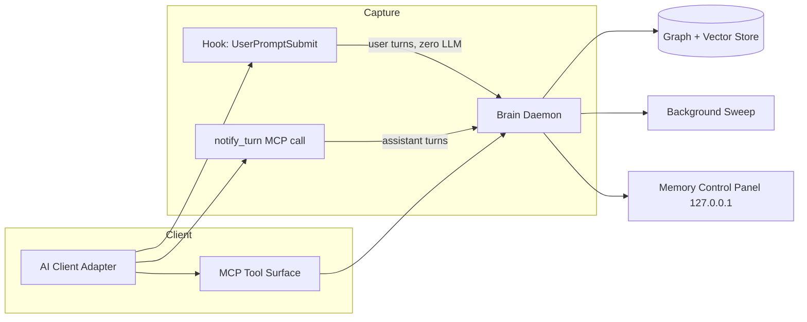
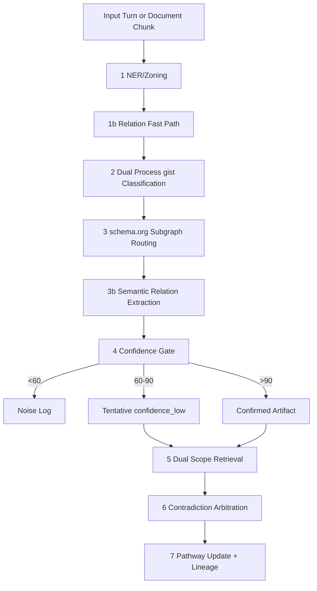
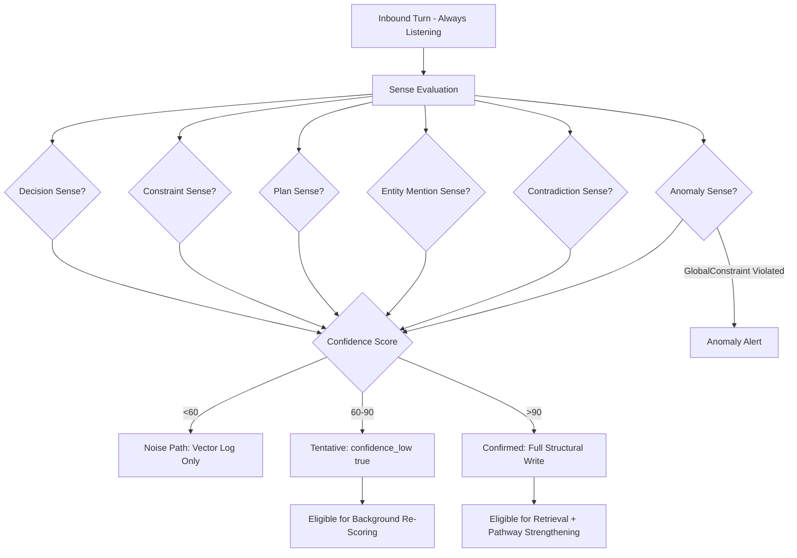
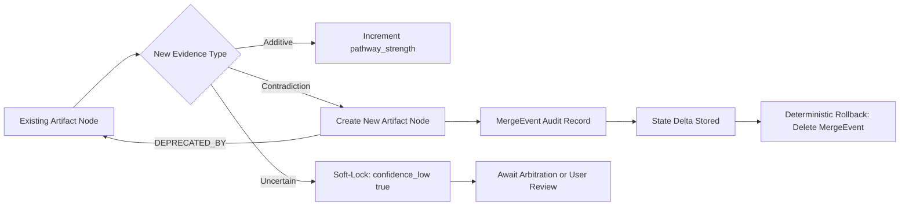
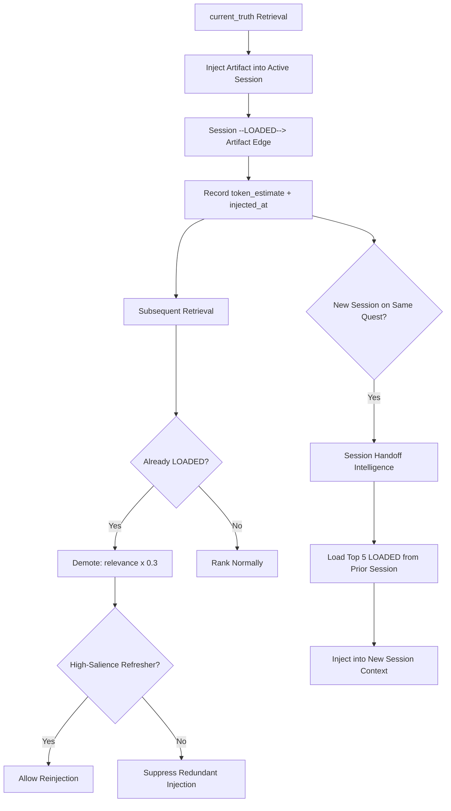
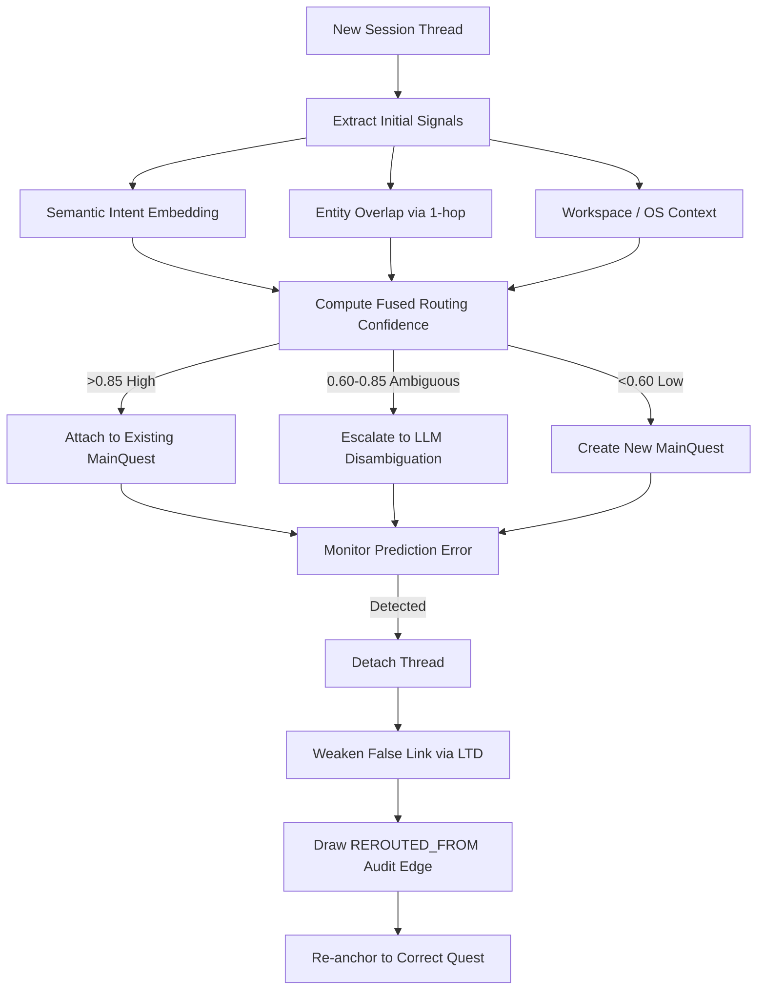
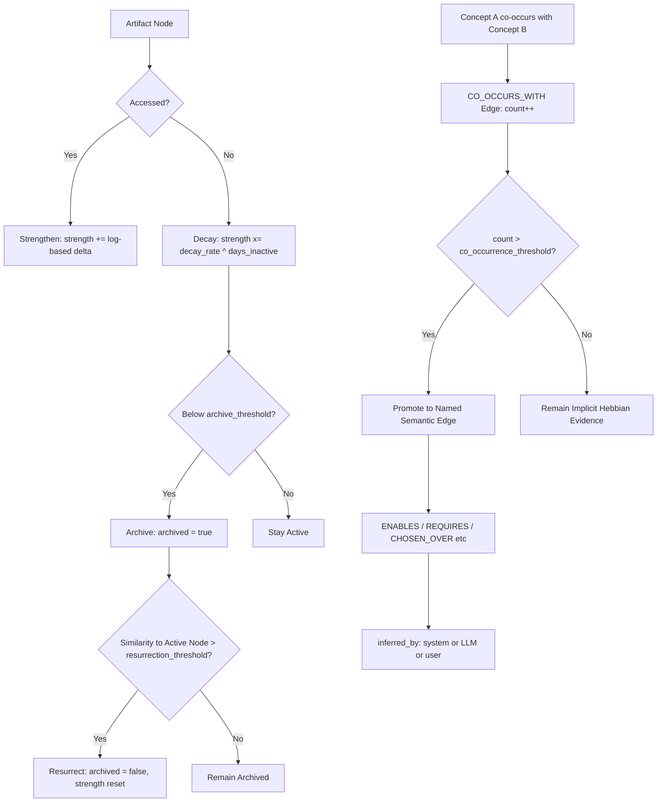

# Side Quests Patent Figures (Draft Packet)

This document is a draft figure packet for provisional filing preparation.

Usage:
- Export each figure section below as a separate page image or PDF page.
- Keep labels exactly as FIG. 1 through FIG. 6.
- Preserve caption text consistency with the notebook specification.

## FIG. 1 - System Architecture (Decoupled Brain Model)

Caption:
FIG. 1 illustrates the modular, decoupled system topology comprising per-client adapters, two separate message capture paths, a local Brain Daemon, graph/vector persistence, and a user-facing memory control panel.

## FIG. 2 - 9-Step Gated Consolidation Loop

Caption:
FIG. 2 illustrates the ordered 9-step consolidation method from incoming turn or document input through concept extraction, dual-process classification, sub-graph routing, relation extraction, confidence gating, retrieval, arbitration, and pathway update with auditable lineage.

## FIG. 3 - Cocktail Party Effect: Selective Attention and Confidence Gating

Caption:
FIG. 3 illustrates the passive selective attention mechanism (the Cocktail Party Effect) in which specific cognitive senses fire on inbound content, confidence scoring gates the result into noise, tentative, or confirmed paths, and confirmed artifacts enter structural memory while tentative artifacts remain eligible for re-scoring.

## FIG. 4 - Temporal Truth and Reversible Merge Lineage

Caption:
FIG. 4 illustrates temporal truth handling in which additive evidence strengthens existing artifact pathway_strength, contradictory evidence preserves prior state under a DEPRECATED_BY edge, and a MergeEvent audit record enables deterministic rollback.

## FIG. 5 - Working Memory Awareness, Smart Deduplication, and Session Handoff

Caption:
FIG. 5 illustrates working-memory state tracking via Session-to-Artifact [LOADED] edges, token burden estimation, smart deduplication with relevance demotion, refresher reinjection, and Session Handoff Intelligence that seeds a new session with the prior session's top loaded artifacts.

## FIG. 6 - Semantic Quest Routing (Hippocampus Mechanism)

Caption:
FIG. 6 illustrates the multi-signal routing fusion method that dynamically associates a new session thread with an existing quest, escalates to LLM disambiguation on ambiguity, and triggers prediction-error-driven memory reconsolidation using Long-Term Depression (LTD) when an incorrect attachment is detected.

## FIG. 7 - Synaptic Pruning, Hebbian Learning, and Long-Term Potentiation

Caption:
FIG. 7 illustrates the use-based memory strengthening and time-decay pruning model, in which pathway_strength increases on access and decays exponentially during inactivity, archived nodes are resurrected by embedding similarity above a threshold, and implicit CO_OCCURS_WITH edges are promoted to named semantic edges via Hebbian Long-Term Potentiation.

## Export Checklist

1. One figure per output page.
2. Retain label format: FIG. X.
3. Keep captions synchronized with the Brief Description in the investor notebook Section 6.1.
4. Verify line-work readability in grayscale print.
5. Include FIG. 1 through FIG. 7 in the provisional filing appendix.
